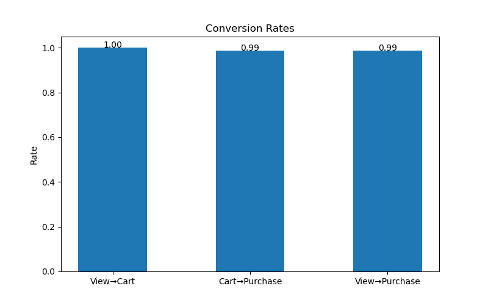
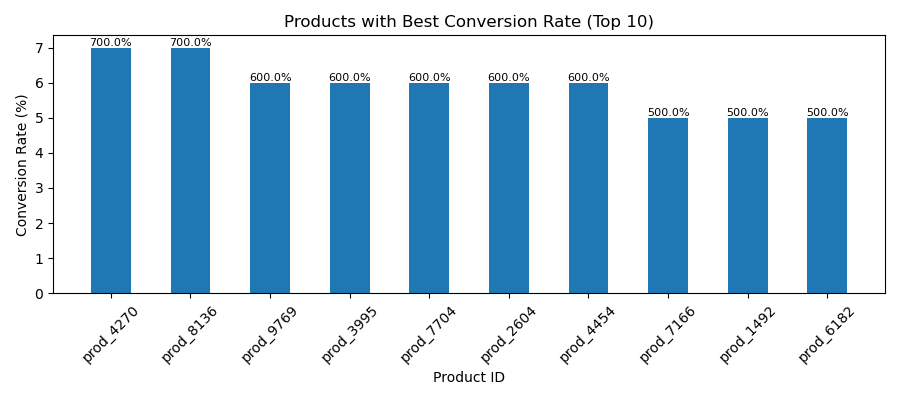
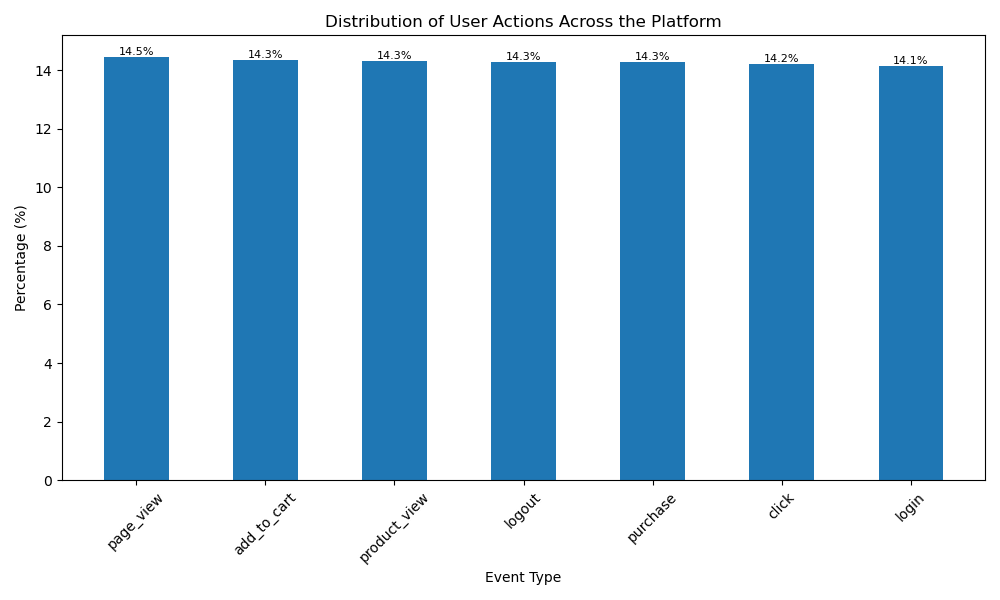
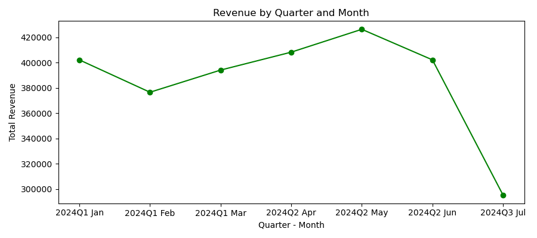

# E-commerce User Behavior and Conversion Analysis

**Objective:** Analyze user behavior using clickstream data to identify conversion patterns, drop-off points, and opportunities to improve the user journey from product view to purchase.

## Diagnosing Conversion Patterns Across 75K+ Clickstream Events

**Dataset:** ~75K clickstream events and transactions from a simulated e‑commerce store  
https://www.kaggle.com/datasets/waqi786/e-commerce-clickstream-and-transaction-dataset
## 📊 Dataset Overview

| Metric        | Value                                                                |
| ------------- | -------------------------------------------------------------------- |
| Total Records | 74,000+                                                              |
| Unique Users  | 1000                                                                 |
| Products      | 8700+                                                                |
| Event Types   | page_view, product_view, add_to_cart, purchase, login, logout, click |

Dataset contains user interaction events across multiple sessions.

## Business Problem

The e-commerce platform generates high user activity with ~73,000 sessions, but lacks clear visibility into how user interactions translate into conversions and revenue.

Despite strong engagement, key decision-making gaps remain:

**Key Questions**

- Where does the conversion funnel break, and what causes drop-offs?
- Which products receive high views but low purchases?
- What user actions are most strongly associated with successful conversions?
- Which products contribute the most to overall revenue?
- How do user sessions differ between converting and non-converting behavior?
- Do repeat users (multiple sessions) show higher likelihood of purchase?

## Key Metrics

* Total Events: **74K+**
* Total Users: **1000**
* Total Sessions: **~73K**
* Total Purchases: **10K+**
* Avg Sessions per User: **~74**
* Funnel Stages: **Product View → Cart → Purchase**


## Key Analyses & Metrics

- **Product Interaction Analysis:** Identified top-performing products based on user interactions (~74K events), highlighting high-engagement items.
- **Conversion Funnel Analysis:** Evaluated session-level funnel (product view → add to cart → purchase) and identified significant drop-offs before the purchase stage.
- **Session Analysis:** Reconstructed ~73K sessions (45-min threshold) with an average of ~74 sessions per user, indicating strong user engagement.
- **User Behavior Analysis:** Compared repeat users vs one-time users, showing higher engagement among returning users.
- **Conversion Behavior Analysis:** Analyzed 10K+ purchase sessions to understand actions leading to successful conversions.

## Data Understanding & Cleaning

- Explored dataset structure (~74K records) to understand relationships between **users, sessions, and products**
- Analyzed missing values:
  - ProductID missing for non-product events
  - Amount & Outcome present only for purchase events
    -Ensured correct interpretation of event-specific data
- Validated relationships using keys:
  - UserID,session_id,ProductID

## Key Insights

- High user engagement observed with **~74 sessions per user on average**, indicating frequent return behavior
- Conversion funnel shows strong progression across stages, with **10K+ purchase events**, suggesting active transaction behavior
- Several products have **high views but low purchases**, indicating potential gaps in pricing, product presentation, or trust
- Revenue is concentrated among a **small subset of products**, highlighting dependency on top-performing items
- Purchase sessions include multiple interactions (views, cart actions), showing that **engagement-driven behavior leads to conversion**

## Business Recommendations

- **Optimize low-converting products**
  Improve pricing, product descriptions, and visuals; add reviews and trust signals to increase purchase confidence
- **Reduce checkout friction**
Simplify the add-to-cart → purchase flow and improve UI/UX for faster conversions
- **Promote high-performing products**
Use recommendations, featured listings, and targeted campaigns to maximize revenue
- **Leverage user engagemen**t
Apply retargeting strategies and personalized recommendations for active and returning users
- **Enhance data tracking**
Improve event tracking and sequencing to better capture user journeys and drop-off points

## Key Visualizations

### Funnel Analysis


### Conversion Rate


### User Behavior


### Monthly Revenue


##  Tools & Techniques

* **Python** – Data preprocessing, sessionization, and behavioral analysis

* **Pandas** – Groupby operations, aggregations, and session-level feature engineering

* **Matplotlib** – Visualization of event distributions and purchase behavior patterns

* **Jupyter Notebook** – Exploratory analysis and structured workflow execution

## Project Structure

```
├── data/
│   └── ect.csv                  # Raw dataset
├── notebooks/
│   └── clickstream_analysis.ipynb   # Main analysis notebook
├── outputs/
│   └── charts/                  # Generated visualizations
├── README.md                    # Project documentation
├── images/
│   ├── funnel_drop_off.png
│   ├── conversion_rate.png
│   ├── user_behavior.png
│   └── monthly_revenue.png
...

